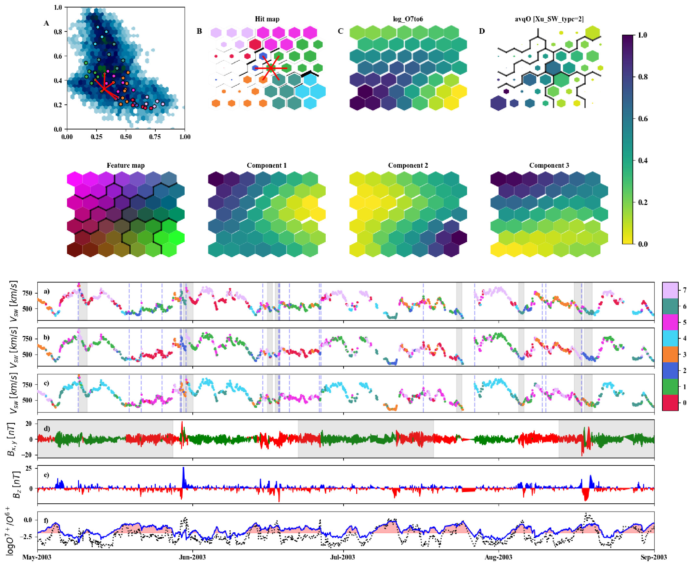

[](https://creativecommons.org/licenses/by/4.0/)

# swinsom

Solar Wind classification using Self-Organizing Maps.



# Installation

Please check the [requirements.txt](https://github.com/murci3lag0/swinsom/blob/master/requirements.txt) file for information about the packages and versions used to produce the publication results.

To install requirements use:

```console
pip install -r requirements.txt
```

# Use

The main file controling the execution of the full architecturs is [swinsom-ace.py](https://github.com/murci3lag0/swinsom/blob/master/swinsom-ace.py). Please launch this file using the following arguments:

```console
python swinsom-ace.py <case> <mode>
```

where `<case>` can be any of `Amaya`, `Roberts`, `XuBorovsky` or `ZhaZuFi`, and `<mode>` can be `new` or `load`.

The `new` option will launch the full data pre-processing, encoding, training and figure reproduction. The option `load` will load the data stored in the pickle files. Please check the optional flags inside the `swinsom-ace.py` file to change the run options. The ACE files are available via FTP in [this link at the ACE Science Center](ftp://mussel.srl.caltech.edu/pub/ace/level2/multi/). The data has been tranformed from .hdf (HDF4) format to .h5 (HDF5) format, using [hdfview](https://www.hdfgroup.org/downloads/hdfview/).

# Publications

This code was used in the following publications:
- [](https://www.frontiersin.org/research-topics/10384/machine-learning-in-heliophysics) Special Issue of Frontiers in Astronomy and Space Sciences Space Physics.

# Author

[](https://orcid.org/0000-0003-1320-8428) The software in this repository has been written by Jorge Amaya
